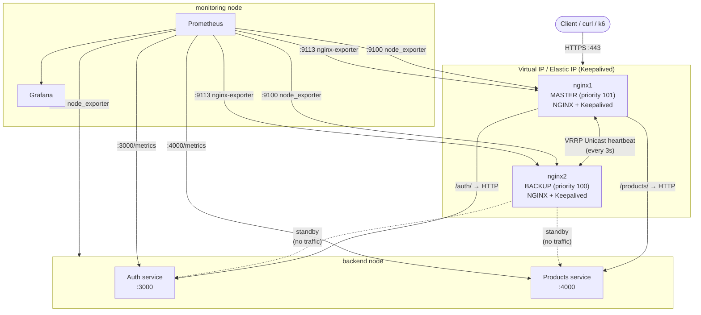
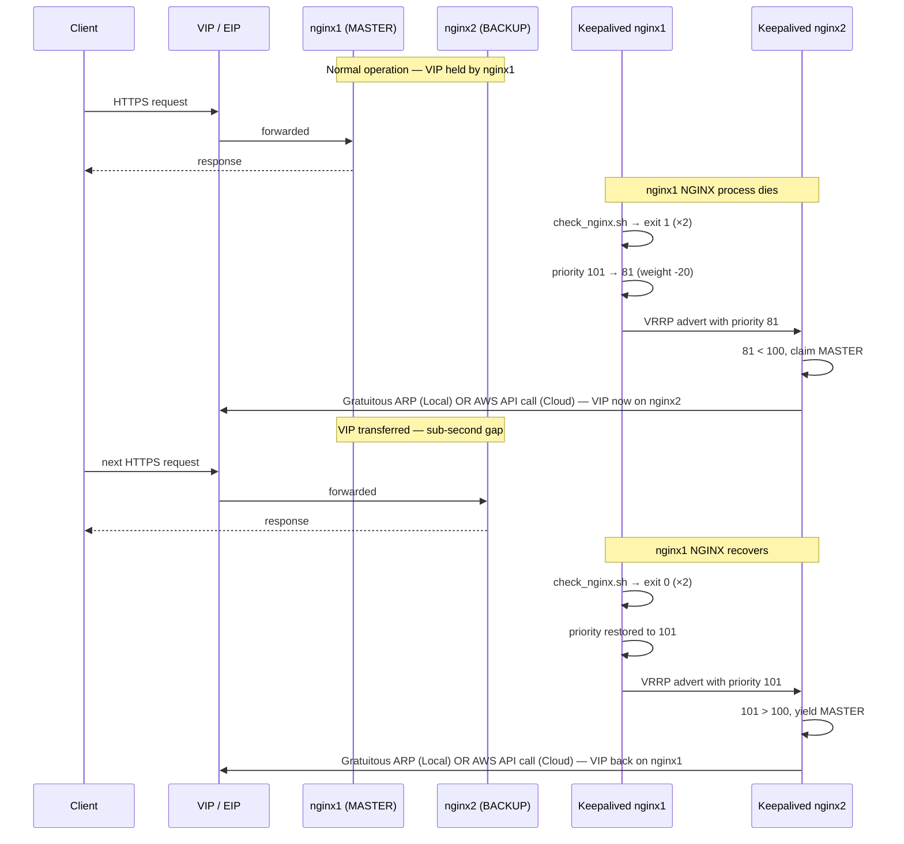
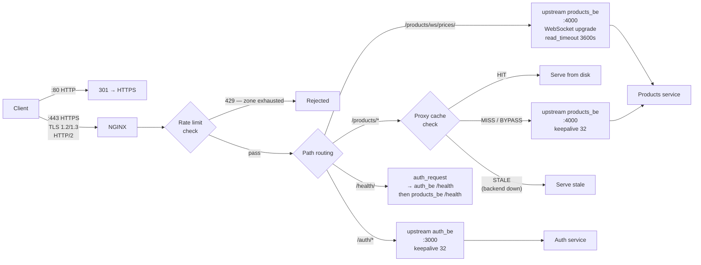
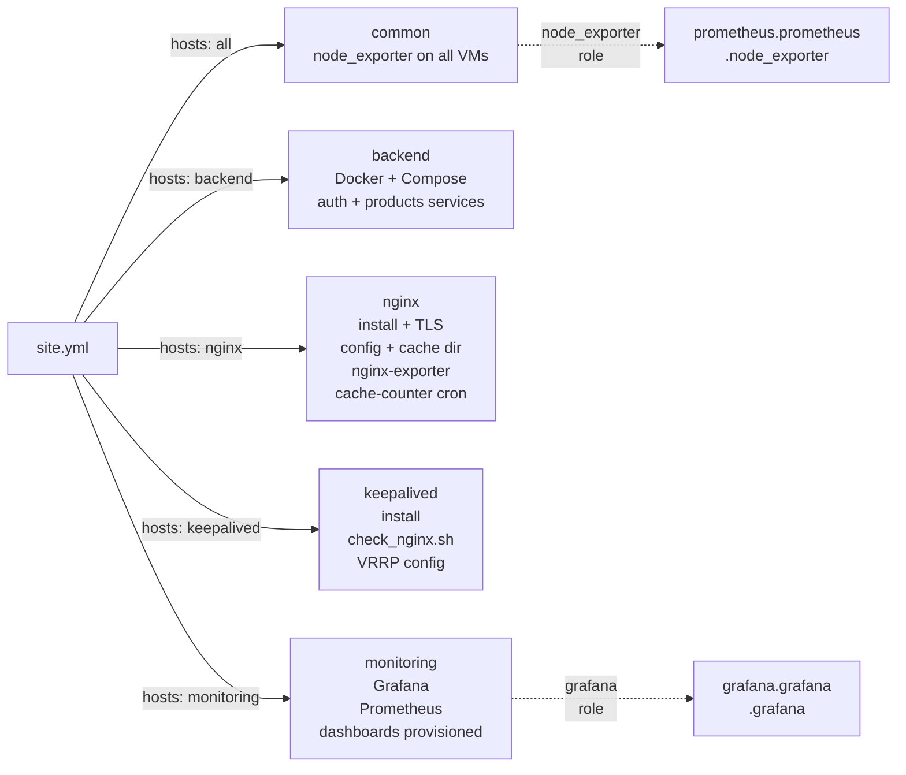

# nginx-ha

A production-grade NGINX high-availability reverse proxy with sub-second failover, automated with Ansible and Terraform, and observed with Prometheus and Grafana. Built as a DevOps portfolio project to demonstrate infrastructure automation, HA networking, NGINX internals, and observability.

This project supports **two deployment modes**:

- **Local lab**: Vagrant + VirtualBox
- **AWS**: Terraform + EC2 + bastion jump host + generated Ansible inventory

---

## Deployment modes

### 1) Local (Vagrant)

- Uses static private network IPs (`192.168.56.0/24`).
- Keepalived VIP: `192.168.56.15`.
- Fastest path for iteration, offline development, and debugging.

### 2) AWS (Terraform)

- Creates EC2 instances in a VPC (private + public subnets).
- Uses a **bastion** node as a stable, secure SSH jump host.
- NGINX nodes are private by default; Keepalived failover uses an AWS API call to move a floating public Elastic IP (EIP) for service entry.
- Inventory is generated dynamically from Terraform outputs (`infra/ansible/gen_inv.sh`).

---

## One-command deployment helper

At the repo root, there is a master script to handle the end-to-end setup:

`./deploy.sh`

It will:

1. Ask whether you want to deploy to **local** or **aws**.
2. For **local**:
   - Run `vagrant up`.
   - Run Ansible with the static `infra/ansible/inventory.ini`.
3. For **aws**:
   - Prompt for the Terraform variable `ssh_key_name` (from `infra/terraform/variables.tf`).
   - Prompt for your local PEM private key path.
   - Run `terraform init && terraform apply`.
   - Run `infra/ansible/gen_inv.sh` to build the dynamic inventory.
   - Run the Ansible playbook with the newly generated `inventory_aws_ssh.ini`.

---

## Architecture

### Infrastructure overview



### Failover sequence



### NGINX request flow



### Ansible role dependency graph



---

## AWS access model (important)

- SSH administrative access should **always** go through the **bastion** host.
- NGINX nodes should not be used as your permanent jump host.
- The floating EIP can move between nginx nodes during failover, making it too fragile to tie admin SSH access to the active NGINX public IP.
- `gen_inv.sh` inherently uses the bastion public IP as the jump host and leverages private IPs for configuring all internal nodes via `ProxyCommand`.

---

## VM layout (Local Environment Example)

| VM         | IP            | Role                         | Key ports  |
| ---------- | ------------- | ---------------------------- | ---------- |
| backend    | 192.168.56.11 | Auth + Products services     | 3000, 4000 |
| nginx1     | 192.168.56.12 | NGINX MASTER                 | 443, 9113  |
| nginx2     | 192.168.56.13 | NGINX BACKUP                 | 443, 9113  |
| monitoring | 192.168.56.14 | Prometheus + Grafana         | 9090, 3000 |
| VIP / EIP  | 192.168.56.15 | Floats between nginx1/nginx2 | —          |

_(Note: In AWS mode, a dedicated Bastion host is added, and IPs are assigned dynamically via DHCP within the VPC subnets)._

---

## Prerequisites

- **Local mode:**
  - [Vagrant](https://www.vagrantup.com/) + VirtualBox
  - [Ansible](https://www.ansible.com/) >= 2.9
- **AWS mode:**
  - [Terraform](https://www.terraform.io/)
  - AWS CLI & credentials configured
  - `jq` (required by `gen_inv.sh` to parse Terraform outputs)
  - Existing EC2 key pair in AWS matching your local PEM file.
- **Python dependencies** (Ansible controller): `requests` library (`pip install requests`).

Install required Ansible collections:

```bash
ansible-galaxy collection install -r infra/ansible/requirements.yml
```

---

## Quick start

### Local

```bash
vagrant up
cd infra/ansible
ansible-playbook -i inventory.ini site.yml
```

Verify NGINX is serving through the local VIP:

```bash
curl -sk [https://192.168.56.15/health/](https://192.168.56.15/health/)
# → {"ok":true}
```

### AWS

```bash
./deploy.sh
# choose aws
# provide ssh_key_name when asked (default: kofta)
# provide local PEM file path
```

**Or manually on AWS:**

```bash
cd infra/terraform
terraform init
terraform apply -var="ssh_key_name=kofta"

cd ../ansible
SSH_KEY_FILE=/home/kofta/Downloads/kofta-eu1.pem ./gen_inv.sh
ansible-playbook -i inventory_aws_ssh.ini site.yml
```

---

## Terraform variable used in AWS flow

Defined in `infra/terraform/variables.tf`:

```hcl
variable "ssh_key_name" {
  description = "Existing AWS EC2 key pair name for SSH"
  type        = string
  default     = "kofta"
}
```

---

## Inventory generation (AWS)

`infra/ansible/gen_inv.sh` reads Terraform outputs and builds `inventory_aws_ssh.ini` with:

- `backend`, `nginx`, and `monitoring` hosts on private IPs.
- Keepalived host vars (`vrrp_role`, `vrrp_priority`) injected from `instances_meta`.
- `vip_allocation_id` mapped from Terraform output.
- Bastion-based `ProxyCommand` logic applied to private hosts.

Run manually:

```bash
cd infra/ansible
SSH_KEY_FILE=/absolute/path/to/key.pem ./gen_inv.sh
```

---

## Running individual roles

You can target specific tags to avoid running the full playbook:

```bash
# Only NGINX config
ansible-playbook -i <inventory_file> site.yml --tags nginx

# Only Keepalived
ansible-playbook -i <inventory_file> site.yml --tags keepalived

# Only monitoring
ansible-playbook -i <inventory_file> site.yml --tags monitoring
```

---

## NGINX configuration decisions

### TLS

TLS 1.2 and 1.3 only — older versions dropped. TLS 1.3 handles the vast majority of modern clients; 1.2 is retained for compatibility. ECDHE cipher suites only, no RC4, 3DES, or anonymous ciphers. `ssl_session_cache shared:SSL:10m` caches negotiated sessions across worker processes so returning clients skip the full handshake.

### HTTP/2

Enabled on the HTTPS listener. Requires TLS — HTTP/2 cleartext (h2c) is not configured since all traffic is already encrypted at the listener level.

### Upstream keepalive

`keepalive 32` on each upstream block maintains up to 32 idle connections per worker to the backend. Without this, every proxied request pays a full TCP handshake to the backend. Requires `proxy_http_version 1.1` and `proxy_set_header Connection ""` in each location.

### Timeouts

| Directive               | Value | Reason                                                                        |
| ----------------------- | ----- | ----------------------------------------------------------------------------- |
| `proxy_connect_timeout` | 5s    | Backend not responding within 5s → give up immediately                        |
| `proxy_send_timeout`    | 30s   | Gap between successive writes to backend                                      |
| `proxy_read_timeout`    | 30s   | Gap between successive reads from backend (overridden to 3600s for WebSocket) |
| `client_header_timeout` | 12s   | Prevent slow-header attacks                                                   |
| `client_body_timeout`   | 20s   | Prevent slow-body attacks                                                     |
| `send_timeout`          | 60s   | Drop clients that stop reading responses                                      |
| `keepalive_timeout`     | 65s   | Slightly longer than browser defaults so server never closes first            |
| `keepalive_requests`    | 1000  | Max requests per keepalive connection before recycling                        |

### Rate limiting

Two zones defined in shared memory: `auth` (5 req/s, burst 10) and `main` (10 req/s, burst 20). Stricter limits on auth since it's a credential endpoint. `nodelay` serves burst requests immediately rather than queuing them. `limit_req_status 429` returns a proper Too Many Requests rather than the default 503.

### Proxy cache

Products API responses are cached on disk at `/var/cache/nginx/products`. Cache key is `$request_method$request_uri`. Valid 200 responses are cached for 5 minutes. `proxy_cache_use_stale error timeout http_500 http_502 http_503` means NGINX serves the last known good response if the backend goes down. `proxy_cache_lock on` prevents cache stampedes.

### WebSocket proxying

Upgrade and Connection headers forwarded to backend. `proxy_read_timeout` set to 3600s on the WebSocket location only.

### Health check endpoint

`/health/` uses NGINX's `auth_request` module to fan out to both backend services — it first calls auth's `/health` as a subrequest, and only proxies to products' `/health` if auth returns 2xx.

---

## Keepalived design

### VRRP priority and weight

nginx1 runs with base priority 101, nginx2 with 100. The `check_nginx.sh` script runs every 2 seconds. If it fails twice consecutively (`fall 2`), Keepalived reduces the effective priority by `weight -20`, dropping nginx1 to 81. nginx2 detects the lower priority advert, claims MASTER, and shifts the IP.

### AWS Mode & Elastic IPs

AWS blocks standard VRRP multicast. In AWS mode, Keepalived is configured strictly for **Unicast**. Furthermore, because AWS prevents arbitrary MAC/ARP spoofing, the failover process triggers a custom `claim_eip.sh` script via `notify_master` that uses the AWS EC2 API to instantly re-associate the public Elastic IP to the newly elected Master node.

### Health check script

The script confirms the NGINX process is running with `pgrep`, then makes a real HTTP request to `https://localhost/health/` and checks for a 200 response. Keepalived runs these health check scripts as a dedicated `keepalived_script` system user with `enable_script_security` in `global_defs`.

---

## Observability

### Metrics sources

| Source                      | Port     | What it exposes                                              |
| --------------------------- | -------- | ------------------------------------------------------------ |
| node_exporter (all VMs)     | 9100     | CPU, memory, disk, network, load                             |
| nginx-prometheus-exporter   | 9113     | Active connections, accepted/handled, request rate           |
| Auth service `/metrics`     | 3000     | HTTP request rate/latency, JWT issued/verified               |
| Products service `/metrics` | 4000     | HTTP request rate/latency, WS connections, price updates     |
| Cache counter (textfile)    | via 9100 | `nginx_cache_requests_total{status}` — HIT/MISS/BYPASS/STALE |

### Cache metrics pipeline

The custom `cache-counter.sh` script parses NGINX logs and uses an atomic write pattern (`.tmp` to `.prom` rename) so Prometheus's `node_exporter` never reads a partially-written file.

### Grafana dashboards

Two dashboards are provisioned automatically via Ansible:

1. **v1 — Monitoring Dashboard:** Baseline connection/API metrics.
2. **v2 — NGINX HA Full Observability:** 28-panel dashboard covering NGINX connection state, failover timelines, dropped connections, API latency percentiles (p50/p95/p99), event loop lag, cache hit ratios, and more.

---

## Common pitfalls & Known limitations

- **Permission denied (publickey):**
  - Usually the wrong PEM file for the instance key pair. Fix with a matching AWS key pair + `chmod 400` on the PEM.
- **Jump host loop:**
  - Don’t ProxyJump the jump host through itself. Ensure Bastion/Public nginx connects directly.
- **EC2 vCPU quota exceeded:**
  - Free tier limits can be strict. Reduce instance count or request a quota increase if deploying outside the free tier bounds.
- **Dynamic IP drift:**
  - Always regenerate the AWS inventory (`gen_inv.sh`) after running a new Terraform apply.
- **Rate limit state is per-node:** - In-memory `limit_req_zone` is not shared between nginx1 and nginx2. In this active-passive setup, it does not matter.
- **Self-signed certificates:** - Both nodes generate independent self-signed certs via Ansible. In an active-active production environment, Let's Encrypt or a shared certificate vault would be required.
- **Backend is a single point of failure:** - NGINX's `proxy_next_upstream` handles transient failures, but a full backend VM crash means downtime. Production would scale the backend instances.

---

## Repository structure

```text
nginx-ha/
├── deploy.sh
├── Vagrantfile
├── infra/
│   ├── terraform/
│   │   ├── main.tf
│   │   ├── variables.tf
│   │   ├── instances.tf
│   │   ├── vpc.tf
│   │   └── outputs.tf
│   └── ansible/
│       ├── ansible.cfg
│       ├── site.yml
│       ├── inventory.ini
│       ├── inventory_aws_ssh.ini         # generated dynamically
│       ├── gen_inv.sh
│       ├── requirements.yml
│       └── roles/
│           ├── backend/
│           ├── common/
│           ├── nginx/
│           ├── keepalived/
│           └── monitoring/
└── services/
    ├── compose.yml
    ├── auth/
    └── products/
```

---

## Notes

- If you use AWS keepalived EIP failover, ensure your EC2 IAM role allows:
  - `ec2:AssociateAddress`
  - `ec2:DisassociateAddress`
- If using scripts for failover actions, ensure:
  - Valid shebang
  - LF line endings
  - Executable bit set (`chmod +x`)
