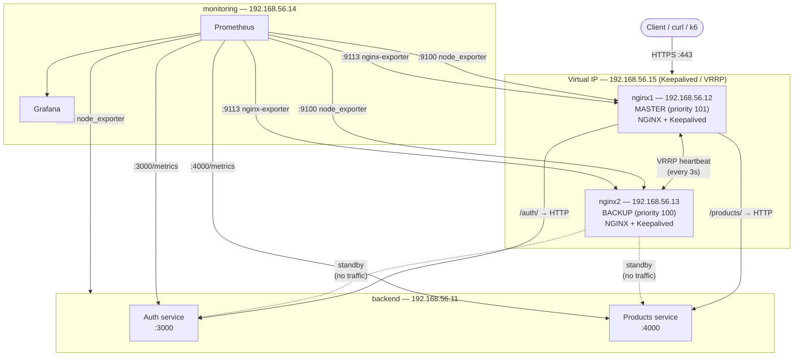
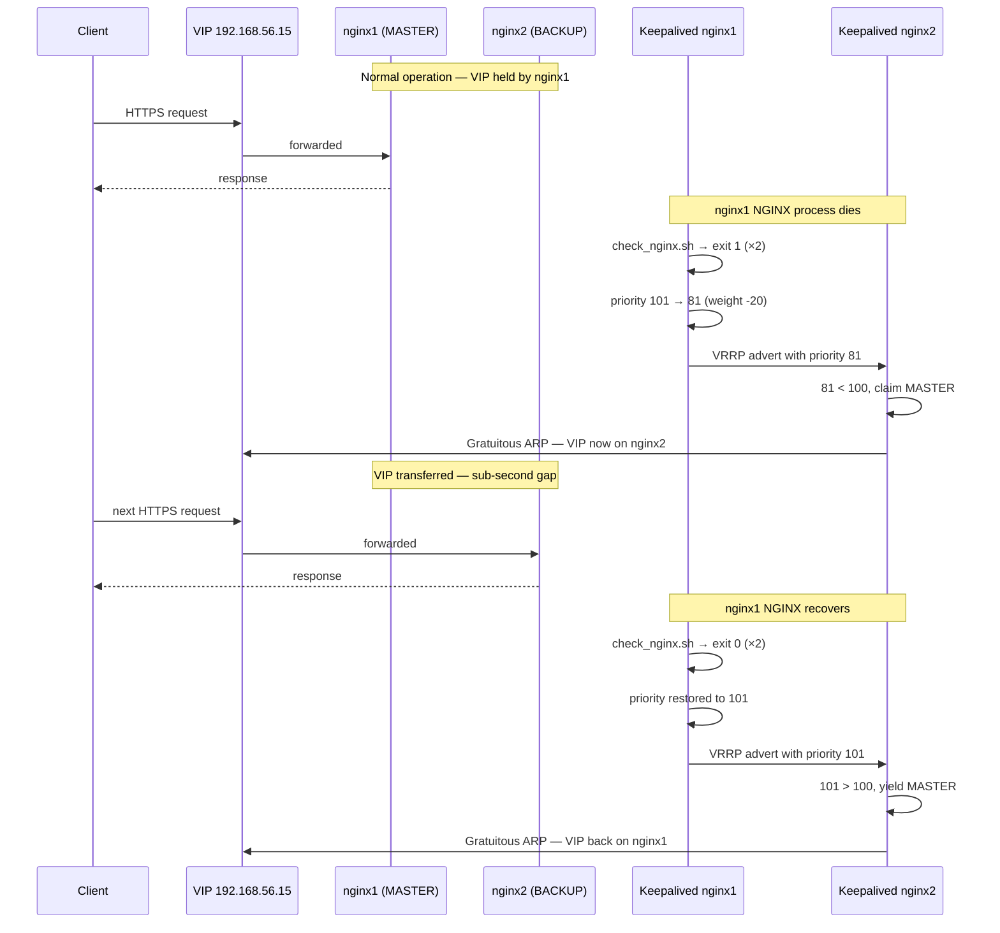
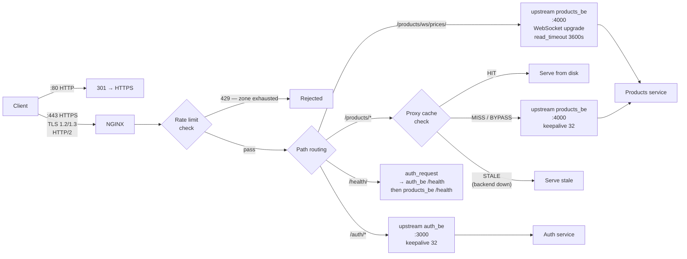
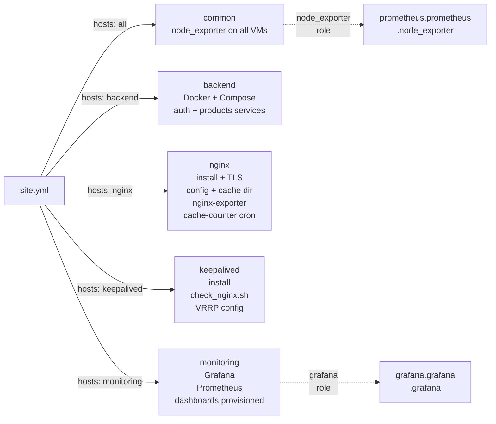
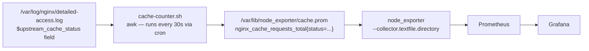

# nginx-ha

A production-grade NGINX high-availability reverse proxy with sub-second failover, fully automated with Ansible, and observed with Prometheus and Grafana. Built as a DevOps portfolio project to demonstrate infrastructure automation, HA networking, NGINX internals, and observability.

---

## Architecture

### Infrastructure overview



### Failover sequence



### NGINX request flow



### Ansible role dependency graph



---

## VM layout

| VM         | IP            | Role                         | Key ports  |
| ---------- | ------------- | ---------------------------- | ---------- |
| backend    | 192.168.56.11 | Auth + Products services     | 3000, 4000 |
| nginx1     | 192.168.56.12 | NGINX MASTER                 | 443, 9113  |
| nginx2     | 192.168.56.13 | NGINX BACKUP                 | 443, 9113  |
| monitoring | 192.168.56.14 | Prometheus + Grafana         | 9090, 3000 |
| VIP        | 192.168.56.15 | Floats between nginx1/nginx2 | —          |

---

## Prerequisites

- [Vagrant](https://www.vagrantup.com/) + VirtualBox
- [Ansible](https://www.ansible.com/) >= 2.9
- Python `requests` library on the Ansible controller (`pip install requests`)

Install required Ansible collections:

```bash
ansible-galaxy collection install -r infra/ansible/requirements.yml
```

---

## Quick start

```bash
# Bring up all four VMs
vagrant up

# Run the full playbook
cd infra/ansible
ansible-playbook -i inventory.ini site.yml
```

Verify NGINX is serving through the VIP:

```bash
curl -sk https://192.168.56.15/health/
# → {"ok":true}
```

Open Grafana at `http://192.168.56.14:3000` (admin / see `monitoring/vars/main.yml`).

---

## Running individual roles

```bash
# Only NGINX config
ansible-playbook -i inventory.ini site.yml --tags nginx

# Only Keepalived
ansible-playbook -i inventory.ini site.yml --tags keepalived

# Only monitoring
ansible-playbook -i inventory.ini site.yml --tags monitoring
```

---

## NGINX configuration decisions

### TLS

TLS 1.2 and 1.3 only — older versions dropped. TLS 1.3 handles the vast majority of modern clients; 1.2 is retained for compatibility. ECDHE cipher suites only, no RC4, 3DES, or anonymous ciphers. `ssl_session_cache shared:SSL:10m` caches negotiated sessions across worker processes so returning clients skip the full handshake.

### HTTP/2

Enabled on the HTTPS listener. Requires TLS — HTTP/2 cleartext (h2c) is not configured since all traffic is already encrypted at the listener level.

### Upstream keepalive

`keepalive 32` on each upstream block maintains up to 32 idle connections per worker to the backend. Without this, every proxied request pays a full TCP handshake to the backend. Requires `proxy_http_version 1.1` and `proxy_set_header Connection ""` in each location — HTTP/1.0 has no keepalive support and NGINX defaults to 1.0 for upstream traffic.

### Timeouts

| Directive               | Value | Reason                                                                        |
| ----------------------- | ----- | ----------------------------------------------------------------------------- |
| `proxy_connect_timeout` | 5s    | Backend not responding within 5s → give up immediately                        |
| `proxy_send_timeout`    | 30s   | Gap between successive writes to backend                                      |
| `proxy_read_timeout`    | 30s   | Gap between successive reads from backend (overridden to 3600s for WebSocket) |
| `client_header_timeout` | 12s   | Prevent slow-header attacks                                                   |
| `client_body_timeout`   | 20s   | Prevent slow-body attacks                                                     |
| `send_timeout`          | 60s   | Drop clients that stop reading responses                                      |
| `keepalive_timeout`     | 65s   | Slightly longer than browser defaults so server never closes first            |
| `keepalive_requests`    | 1000  | Max requests per keepalive connection before recycling                        |

### Rate limiting

Two zones defined in shared memory: `auth` (5 req/s, burst 10) and `main` (10 req/s, burst 20). Stricter limits on auth since it's a credential endpoint. `nodelay` serves burst requests immediately rather than queuing them, avoiding artificial latency spikes. `limit_req_status 429` returns a proper Too Many Requests rather than the default 503.

Rate limit state is per-node (in-memory). With VRRP, only one node holds the VIP at any time so both nodes never serve traffic simultaneously — this is a non-issue in this architecture. In an active-active setup, a shared Redis store (via OpenResty/lua-resty-redis) would be required.

### Proxy cache

Products API responses are cached on disk at `/var/cache/nginx/products`. Cache key is `$request_method$request_uri` so GET and POST to the same path are cached separately. Valid 200 responses are cached for 5 minutes. `proxy_cache_use_stale error timeout http_500 http_502 http_503` means NGINX serves the last known good response if the backend goes down — clients see slightly stale data rather than a 502. `proxy_cache_lock on` prevents cache stampede by serialising concurrent requests for the same uncached key. `proxy_cache_bypass $http_authorization` and `proxy_no_cache $http_authorization` skip cache for authenticated requests to prevent cross-user cache poisoning.

### WebSocket proxying

Upgrade and Connection headers forwarded to backend. `proxy_read_timeout` set to 3600s on the WebSocket location only — idle WebSocket connections are normal and should not be killed by NGINX's default timeout.

### health check endpoint

`/health/` uses NGINX's `auth_request` module to fan out to both backend services — it first calls auth's `/health` as a subrequest, and only proxies to products' `/health` if auth returns 2xx. Limitation: if auth is down, the health endpoint returns a 500, which Keepalived's check script would interpret as NGINX failure. The health check script independently verifies NGINX is serving rather than relying solely on this endpoint.

---

## Keepalived design

### VRRP priority and weight

nginx1 runs with base priority 101, nginx2 with 100. The `check_nginx.sh` script runs every 2 seconds. If it fails twice consecutively (`fall 2`), Keepalived reduces the effective priority by `weight -20`, dropping nginx1 to 81 — below nginx2's 100. nginx2 detects an advert with lower priority than itself and claims MASTER, sending a gratuitous ARP to move the VIP. The whole transition takes 4–9 seconds from process death to VIP handover (2 intervals × 2 falls + advert interval).

When nginx1 recovers, two consecutive successes (`rise 2`) restore its priority to 101. Since 101 > 100, it preempts nginx2 and reclaims the VIP.

### Health check script

The script does two things: confirms the NGINX process is running with `pgrep`, then makes a real HTTP request to `https://localhost/health/` and checks for a 200 response. Process existence alone is not sufficient — NGINX can be running but stuck or misconfigured. The `-k` flag skips certificate verification since the cert is self-signed and the check is localhost-only.

### Script security

Keepalived runs health check scripts as a dedicated `keepalived_script` system user with `enable_script_security` in `global_defs`. Running scripts as root is a security violation flagged in Keepalived's logs.

---

## Observability

### Metrics sources

| Source                      | Port     | What it exposes                                              |
| --------------------------- | -------- | ------------------------------------------------------------ |
| node_exporter (all VMs)     | 9100     | CPU, memory, disk, network, load                             |
| nginx-prometheus-exporter   | 9113     | Active connections, accepted/handled, request rate           |
| Auth service `/metrics`     | 3000     | HTTP request rate/latency, JWT issued/verified               |
| Products service `/metrics` | 4000     | HTTP request rate/latency, WS connections, price updates     |
| Cache counter (textfile)    | via 9100 | `nginx_cache_requests_total{status}` — HIT/MISS/BYPASS/STALE |

### Cache metrics pipeline



The awk script uses an atomic write pattern — it writes to a `.tmp` file and renames it to `.prom` — so node_exporter never reads a partially-written file.

### Grafana dashboards

Two dashboards are provisioned automatically via Ansible:

**v1 — Monitoring Dashboard** — the baseline dashboard built manually as part of learning Grafana: active connections, request rate, API error rates, CPU/memory per VM, WebSocket connections.

**v2 — NGINX HA Full Observability** — 28-panel dashboard covering NGINX connection state, per-node failover timeline, dropped connections, API latency percentiles (p50/p95/p99), JWT issue vs verify rate, Node.js event loop lag, heap usage, network throughput, cache hit ratio, HIT/MISS/BYPASS/STALE rates, open file descriptors, and service uptime.

---

## Known limitations and production considerations

**Rate limit state is per-node.** In-memory `limit_req_zone` is not shared between nginx1 and nginx2. In this VRRP setup only one node is ever active so this doesn't matter in practice. In an active-active topology a shared Redis store via OpenResty would be required.

**`stub_status` has no per-status-code visibility.** NGINX open-source only exposes aggregate connection counts via `stub_status`. There is no native way to count 4xx/5xx or 429s at the NGINX level without log parsing (mtail) or NGINX Plus. The cache counter demonstrates the log-parsing pattern; the same approach would extend to error rate tracking.

**Self-signed certificates.** Both NGINX nodes generate independent self-signed certs via Ansible. In production, Let's Encrypt with cert-manager, or a shared certificate distributed from a vault, would be used. The current setup means each node presents a different certificate — undetectable with VRRP since only one node serves traffic at a time, but would break in an active-active topology.

**Backend is a single point of failure.** The backend VM runs both services with no redundancy. NGINX's `proxy_next_upstream` and `proxy_cache_use_stale` mitigate transient backend failures but a full backend VM failure means downtime. In production, multiple backend instances behind an internal load balancer (or a second NGINX tier) would be used.

---

## Project structure

```
nginx-ha/
├── infra/
│   └── ansible/
│       ├── site.yml
│       ├── inventory.ini
│       ├── ansible.cfg
│       ├── requirements.yml
│       └── roles/
│           ├── common/          # node_exporter on all hosts
│           ├── backend/         # Docker + Compose deployment
│           ├── nginx/           # NGINX, TLS, config, exporter, cache counter
│           ├── keepalived/      # VRRP config, health check script
│           └── monitoring/      # Prometheus, Grafana, dashboards
└── services/
    ├── compose.yml
    ├── auth/                    # JWT issue/verify — Hono + Bun, port 3000
    └── products/                # REST CRUD + WebSocket feed — Hono + Bun, port 4000
```
